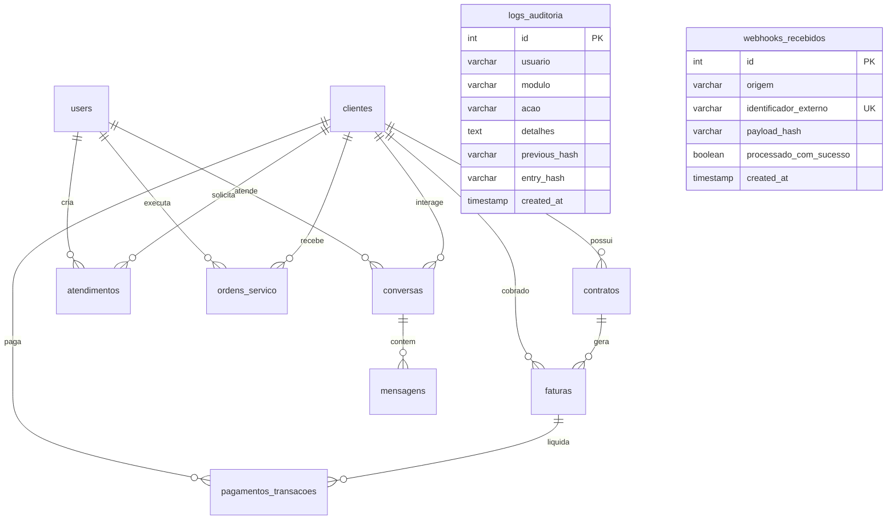

# NAP — Arquitetura de Infraestrutura de Produção (Single-Tenant)

**Sistema:** NAP (Núcleo de Atendimento ao Provedor)  
**Modelo de Implantação:** Instância Dedicada por Provedor (Single-Tenant VPS / Bare Metal)  
**Sistema Operacional Homologado:** Debian 12 (Bookworm) 64-bit  
**Data da Consolidação:** Setembro de 2026

---

## 1. Topologia de Rede e Portas do Servidor

A arquitetura do NAP foi projetada para isolamento rigoroso de tráfego, garantindo que portas administrativas e de dados nunca fiquem expostas à internet pública.

```
                    INTERNET PÚBLICA / REDE DO CLIENTE
                                   │
         ┌─────────────────────────┴─────────────────────────┐
         │                                                   │
  Porta 80/443 (HTTPS)                              Porta 7547 (TCP)
  Nginx Reverse Proxy                               GenieACS TR-069 CWMP
         │                                                   │
         ▼                                                   ▼
┌──────────────────┐                               ┌──────────────────┐
│   NAP Frontend   │                               │  ONUs / CPEs dos │
│ (Admin + Portal) │                               │    Assinantes    │
└────────┬─────────┘                               └────────┬─────────┘
         │                                                   │
         ▼                                                   ▼
┌─────────────────────────────────────────────────────────────────────┐
│                      AMBINETE INTERNO (127.0.0.1)                   │
│                                                                     │
│  • NAP Core (Express/Node.js): Porta 3000                           │
│  • PostgreSQL 16 (Drizzle ORM): Porta 5432                          │
│  • Redis 7 (Cache/Sessions): Porta 6379                             │
│  • MongoDB 6 (GenieACS Data): Porta 27017                           │
│  • GenieACS NBI (Private API): Porta 7557                           │
│  • Asterisk 20+ (ARI / AMI / WSS): 8088 / 5038 / 8089              │
│  • Asterisk SIP / RTP (Telefonia): 5060 UDP / 10000-20000 UDP       │
└─────────────────────────────────────────────────────────────────────┘
```

### Matriz de Portas

| Porta | Protocolo | Escopo | Descrição |
| :--- | :---: | :---: | :--- |
| **80 / 443** | TCP | Público | Acesso Web seguro Nginx com TLS 1.3 (Admin e Portal PWA) |
| **7547** | TCP | Público / WAN | Comunicação CWMP TR-069 das ONUs com o GenieACS |
| **5060 / 5061** | UDP / TCP | Tronco SIP | Sinalização de voz com operadoras / PSTN |
| **8089** | TCP | Público | WebSockets seguros (WSS) para WebRTC Webphone do portal |
| **10000:20000** | UDP | Público | Fluxo de mídia de áudio RTP para chamadas telefônicas |
| **3799** | UDP | Rede Interna | Radius PoD / CoA (Desconexão / Reautorização) |
| **3000** | TCP | **Loopback (127.0.0.1)** | Aplicação NAP Node.js (Acessível apenas via Nginx) |
| **5432** | TCP | **Loopback (127.0.0.1)** | Banco de Dados PostgreSQL (Blindado da WAN) |
| **6379** | TCP | **Loopback (127.0.0.1)** | Cache Redis e Filas de Mensageria |
| **27017** | TCP | **Loopback (127.0.0.1)** | Banco NoSQL MongoDB para inventário GenieACS |
| **7557** | TCP | **Loopback (127.0.0.1)** | API NBI privada do GenieACS |

---

## 2. Diagrama Entidade-Relacionamento (ERD) — Customer 360 Oficial

O modelo relacional do NAP foi unificado em `src/db/schema.ts` para eliminar redundâncias e garantir integridade referencial:



---

## 3. Integração Financeira Enlace-Pay / Banco C6 (336) via mTLS

O módulo financeiro do NAP opera com comunicação bilateral autenticada:
1. **Autenticação mTLS Direta:**
   O certificado do cliente (`/opt/nap/certs/c6_client.crt`) e a chave privada (`/opt/nap/certs/c6_client.key`) são carregados em memória no handshake TLS contra o endpoint `https://pix.c6bank.com.br/api/v2/cob/`.
2. **Geração de Cobrança Pix Dinâmica:**
   Para cada fatura, é criado um `txid` alfanumérico único. A resposta fornece o QR Code dinâmico e a string Copia e Cola.
3. **Webhook Notificação e Baixa:**
   O Banco C6 notifica o endpoint `/api/payments/webhook`. O webhook é autenticado, deduplicado na tabela `webhooks_recebidos` e dispara imediatamente a baixa no ERP do provedor (SGP / IXC / HubSoft).
4. **Fila de Contingência Resiliente (`erpSyncQueue`):**
   Se o ERP estiver temporariamente instável ou inacessível no momento do pagamento, a transação é retida na fila com retry exponencial garantido (Zero Data Loss).

---

## 4. Governança e Resiliência (Memory Fallback)

Para assegurar disponibilidade mesmo em situações atípicas:
- **Circuit Breakers em Módulos Externos:** Se o Zabbix, GenieACS, Asterisk ou SGP ficarem fora do ar, o backend entra em modo de contingência suave, operando com dados em memória e informando o usuário de forma amigável sem interromper os demais módulos.
- **Auditoria Append-Only Contínua:** Todas as alterações administrativas em OLTs, desbloqueios de confiança e parametrizações são carimbadas no banco relacional e assinadas com hash encadeado SHA-256.
