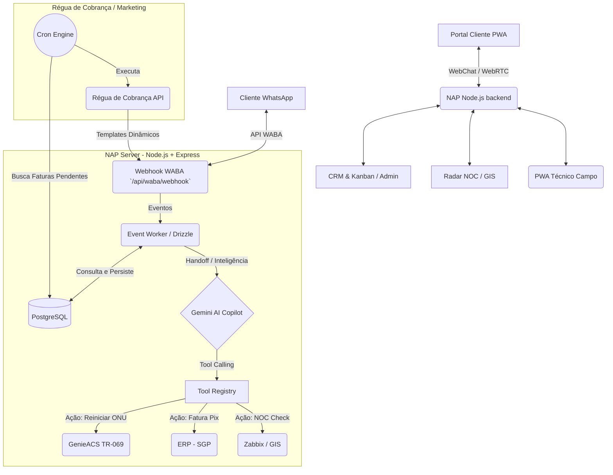

# NAP - Arquitetura de Infraestrutura e Banco de Dados

Este documento apresenta o modelo estrutural do NAP SaaS (Núcleo de Atendimento ao Provedor), focando no armazenamento de dados (PostgreSQL + Drizzle) e as correlações com serviços externos.

## Diagrama Entidade-Relacionamento (ERD) - Core

```mermaid
erDiagram
    users {
        int id PK
        varchar email
        varchar nome
        varchar role "admin, operador, tecnico_n1, tecnico_n2, superadmin"
        varchar photoURL
        timestamp createdAt
    }

    clientes {
        int id PK
        varchar nome
        varchar cpf_cnpj "Unique"
        varchar telefone
        varchar plano_interesse
        varchar status "lead, ativo, bloqueado, cancelado"
        varchar endereco_cep
        timestamp createdAt
    }

    faturas {
        int id PK
        int cliente_id FK
        numeric(15,2) valor "Transacional"
        date vencimento
        varchar status "pendente, pago, vencido"
        text linha_digitavel
        timestamp created_at
    }

    conversas {
        int id PK
        varchar provedor_id "Tenant Isolado"
        varchar cliente_numero "Telefone WhatsApp"
        varchar status "ativa, resolvida, transferida"
        varchar canal "waba, webchat, voz"
        varchar assignee_id "UUID do Operador"
        jsonb contexto_ia "Memória do Gemini"
        varchar waba_session_id
        timestamp created_at
        timestamp updated_at
    }

    mensagens {
        int id PK
        int conversa_id FK
        varchar direction "incoming, outgoing"
        text body
        varchar tipo "texto, imagem, audio, documento, template"
        varchar wabaMessageId "Unique Idempotency Key"
        varchar remote_url "URL do S3/Firebase"
        timestamp created_at
    }

    waba_webhooks {
        int id PK
        varchar provedor_id
        varchar event_type "messages, statuses"
        jsonb payload
        varchar process_status "pending, processed, error"
        timestamp received_at
    }

    atendimentos {
        int id PK
        varchar titulo
        varchar estagio "Prospecção, Suporte_N1, Cobranca"
        varchar pipeline "vendas, suporte, financeiro"
        varchar contato "Nome do Contato"
        varchar valor "R$"
        timestamp created_at
    }

    clientes ||--o{ faturas : "possui"
    clientes ||--o{ atendimentos : "vinculado_a"
    conversas ||--o{ mensagens : "contem"
    users ||--o{ conversas : "atende"
```

## Fluxo de Arquitetura Omnichannel



## Descrição dos Módulos Principais

1. **WABA Engine & Conversas**: A tabela `conversas` centraliza o estado do atendimento. Se o `assignee_id` estiver nulo, quem controla a conversa é a **IA (Gemini)** operando através da coluna `contexto_ia` que armazena a janela de contexto conversacional.
2. **CRM e Atendimentos (Kanban)**: Os `atendimentos` (deals) representam cards no Kanban do SGP emulator. Podem ser gerados automaticamente via WABA através da *tool* de `criar_lead_vendas` e estão atrelados ao funil comercial, suporte ou financeiro.
3. **Régua de Cobrança (Faturas)**: A tabela `faturas` armazena os boletos. O módulo `server/marketing/reguaRoutes.ts` consome dados daqui baseado nos parâmetros `D-3`, `D-0`, `D+3` e interage com o disparo WABA.
4. **Isolamento de Tenant**: Na arquitetura, o banco prevê um `provedor_id`, suportando a filosofia de instalação em máquina (VPS) dedicada, isolando os dados, metadados do WABA, e instâncias de PABX.
